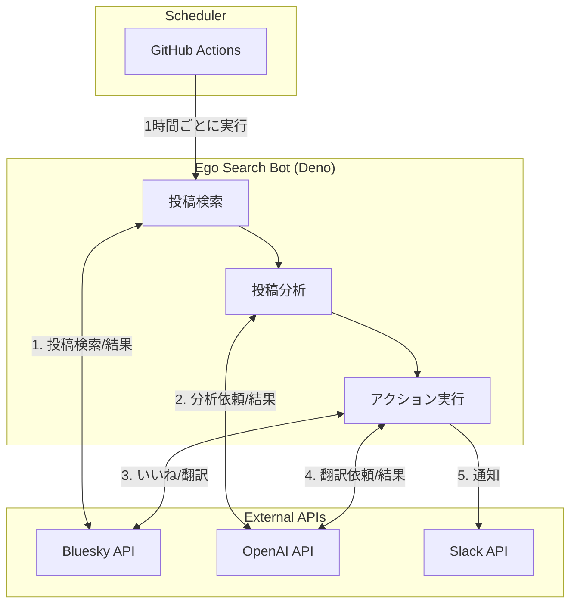

# 🤖 はじめに

個人で[Sky Follower Bridge](https://www.sky-follower-bridge.dev/)というXからBlueskyへの移行ツールを開発しているのですが、拡張機能の評判や不具合報告を見逃さないように、Blueskyでの関連投稿を定期的にチェックする必要がありました。

しかし、手動でのチェックは時間がかかり、見落としも発生します。そこで、GitHub ActionsとChatGPTを活用して、投稿の監視を完全自動化するbotを作成しました。この記事では、その実装について紹介します。

# 🔍 作ったもの

[sfb-ego-searcher](https://github.com/kawamataryo/sfb-ego-searcher)。Sky Follower BridgeについてのBlueskyの投稿を監視するbotです。

https://github.com/kawamataryo/sfb-ego-searcher

機能

- **自動実行**: GitHub Actionsで1時間ごとに実行され、24時間体制で投稿を監視
- **LLMによる投稿分類**: ChatGPT（GPT-4）による投稿内容の意味理解と分類
- **Slack通知**: 投稿の種類に応じた適切なアクションと通知
- **日本語翻訳**: 多言語の投稿の日本語訳も合わせてSlackに通知

# 🛠️ 実装の解説

## 技術スタック

- [Deno](https://deno.land/) 
- [GitHub Actions](https://github.com/features/actions) 
- [OpenAI API（GPT-4）](https://openai.com/blog/openai-api) 
- [Bluesky API](https://atproto.com/docs) 
- [Slack API](https://api.slack.com/) 

## 処理フロー

ざっくりの処理フローは以下の通りです。

## メイン実装

メインの処理は以下のような流れで実装しています。

\`\`\`ts
async function main() {
  try {
    // 各種クライアントの初期化
    const { bluesky, analyzer, slackClient } = await initializeClients();
    const postProcessor = new PostProcessor(bluesky, analyzer, slackClient);

    // 投稿の検索
    const results = await searchPosts(bluesky);
    consola.info(`Found ${results.size} posts`);

    // 投稿を逐次処理
    for (const post of results.values()) {
      await postProcessor.processPost(post);
    }
  } catch (error: unknown) {
    if (error instanceof Error) {
      consola.error(`Fatal error: ${error.message}`);
    } else {
      consola.error("Unknown fatal error occurred");
    }
    Deno.exit(1);
  }
}

async function searchPosts(bluesky: BlueskyClient) {
  const results = new Map();
  await Promise.all(
    SEARCH_QUERIES.map(async (query) => {
      const posts = await bluesky.searchPosts(query, TARGET_TIME);
      for (const post of posts) {
        results.set(`${post.author.did}-${post.uri}`, post);
      }
    }),
  );
  return results;
}
\`\`\`

## 投稿の処理クラス

投稿の処理は`PostProcessor`クラスで行います。投稿の分析結果に応じて、適切なアクションを実行します。

\`\`\`ts
export class PostProcessor {
  constructor(
    private bluesky: BlueskyClient,
    private analyzer: OpenAIClient,
    private slackClient: SlackClient,
  ) {}

  async processPost(post: PostView): Promise<void> {
    try {
      // 自分の投稿やすでにいいねした投稿はスキップ
      if (this.shouldSkipPost(post)) {
        return;
      }

      const postText = (post.record as { text: string }).text;
      const postUrl = this.bluesky.getPostUrl(post);
      
      // ChatGPTで投稿を分析
      const analysis = await this.analyzer.analyze(postText);

      // 対象の投稿でない場合はスキップ
      if (!analysis.isTarget) {
        return;
      }

      // 投稿にいいねを付ける
      await this.bluesky.like(post);

      // 分析結果に応じて投稿を処理
      await this.handlePostByAnalysis(post, analysis, postUrl);
      
      // 日本語訳をSlack通知
      await this.notifyTranslation(postText);
    } catch (error: unknown) {
      // エラーハンドリング
      await this.handleError(error, post);
    }
  }

  private shouldSkipPost(post: PostView): boolean {
    return (
      post.author.did === this.bluesky.getDid() ||
      this.bluesky.hasLiked(post)
    );
  }
}
\`\`\`

## Bluesky APIの使用例

Bluesky APIのラッパークラスでは、投稿の検索やいいね、リプライなどの機能を提供します。

\`\`\`ts
export class BlueskyClient {
  private agent: AtpAgent;
  private likesSet: Set<string> = new Set();

  constructor() {
    this.agent = new AtpAgent({
      service: "https://bsky.social",
    });
  }

  async initialize({ identifier, password }: {
    identifier: string;
    password: string;
  }) {
    await this.agent.login({ identifier, password });
    await this.fetchLikes();
  }

  async searchPosts(query: string, since: Date): Promise<PostView[]> {
    const res = await this.agent.app.bsky.feed.searchPosts({
      q: query,
      limit: 100,
      sort: "latest",
      since: since.toISOString(),
    });
    return res.data.posts;
  }

  async like(post: PostView) {
    await this.agent.com.atproto.repo.createRecord({
      repo: this.agent.did!,
      collection: "app.bsky.feed.like",
      record: {
        $type: "app.bsky.feed.like",
        subject: {
          uri: post.uri,
          cid: post.cid,
        },
        createdAt: new Date().toISOString(),
      },
    });
  }

  getPostUrl(post: PostView): string {
    return `https://bsky.app/profile/${post.author.handle}/post/${
      post.uri.split("/").pop()
    }`;
  }
}
\`\`\`

## GitHub Actionsによる定期実行

GitHub Actionsのワークフローは以下のように設定しています。1時間ごとに実行され、必要な環境変数を設定してDenoスクリプトを実行します。

\`\`\`yaml
name: ego search

on:
  schedule:
    - cron: "0 */1 * * *" # 1時間ごとに実行
  workflow_dispatch: # 手動実行用

jobs:
  run:
    runs-on: ubuntu-latest
    steps:
      - uses: actions/checkout@v4
      - name: Setup Deno
        uses: denoland/setup-deno@v2
      - name: Run script
        env:
          OPENAI_API_KEY: ${{ secrets.OPENAI_API_KEY }}
          BLUESKY_USERNAME: ${{ secrets.BLUESKY_USERNAME }}
          BLUESKY_PASSWORD: ${{ secrets.BLUESKY_PASSWORD }}
          SLACK_BOT_TOKEN: ${{ secrets.SLACK_BOT_TOKEN }}
          SLACK_CHANNEL_ID: ${{ secrets.SLACK_CHANNEL_ID }}
        run: deno run --allow-net --allow-env src/main.ts
\`\`\`

## ChatGPTによる投稿の意味理解

投稿の分析にはChatGPT（GPT-4）を利用しています。以下のようなプロンプトで、投稿の文脈を理解し、適切に分類します。

\`\`\`ts
const res = await this.openai.chat.completions.create({
  messages: [{
    role: "user",
    content: `
Please evaluate the provided text and classify it based on the following criteria:

1. **Target Identification**:
  - Determine if the text explicitly or implicitly refers to any of the following terms:
    - "Sky Follower Bridge"
    - "sky bridge"
    - "follower bridge"
    - "bsky bridge"
  - Exclude references that:
    - Describe generic physical or metaphorical bridges.
    - Relate to cryptocurrency-related projects, tools, or alliances.

2. **Issue Report Detection**:
  - Check if the text indicates a problem, error, or feedback specific to the mentioned tools or terms.

3. **Response Formatting**:
  - Provide the analysis results in JSON format:
    {
      "isTarget": true/false,
      "isIssue": true/false,
    }

Text to analyze:
"""
${text}
"""
    `.trim(),
  }],
  model: "gpt-4",
  response_format: { type: "json_object" },
});
\`\`\`

このように、自然言語での指示をもとに、ChatGPTが投稿の文脈を理解し、適切に分類してくれます。これにより、単純なキーワードマッチでは検出できないような投稿も正確に検知できます。

## 投稿の自動翻訳

英語の投稿は、ChatGPTを使って日本語に翻訳します。製品名は英語のまま保持するように指示を出しています。

\`\`\`ts
const res = await this.openai.chat.completions.create({
  messages: [{
    role: "user",
    content: `
Please translate the following text to Japanese.
Do not translate the terms Sky Follower Bridge, Sky Bridge, and Bsky Bridge; keep them in English.
Provide the response in JSON format with the key "japaneseTranslation".

Text: ${text}
    `.trim(),
  }],
  model: "gpt-4",
  response_format: { type: "json_object" },
});
\`\`\`

## 実際の動作例

実際の動作を見てみましょう。

### 1. 製品への言及を検知

ChatGPTが投稿を分析し、Sky Follower Bridgeへの言及を検知。自動でいいねを付け、Slackに通知します。

### 2. 不具合報告を検知

投稿の文脈から不具合報告だと判断し、緊急度の高い通知を送信します。

# 💭 感想

この記事では、GitHub ActionsとChatGPTを活用したBlueskyのエゴサーチbotの実装について紹介しました。

## 💰 運用コスト

このbotの運用コストで気になるのは、ChatGPT APIの料金です。しかし、実際に運用してみると、予想以上に低コストで運用できています。

1日に100投稿ほど解析していますが、ChatGPT APIの料金は**$0.01以下/日**です。これは、GPT-4を使用しているにも関わらず、とても低コストだと感じています。

## 🦋 Bluesky APIの素晴らしさ

このプロジェクトを通じて、Bluesky APIの素晴らしさを実感しました。認証さえ通れば、無料で柔軟に利用できる点が特に魅力的です。

例えば、Xでは同様のbotを作ろうとすると、API利用に高額な料金が必要です。Blueskyは、開発者フレンドリーなプラットフォームとして、とても好感が持てます。このような開かれたプラットフォームが、今後も発展していくことを願っています。

# 🎯 まとめ

特に以下の点が、このプロジェクトのポイントです：

- GitHub Actionsによる定期実行で、完全自動化を実現
- ChatGPTによる投稿の意味理解で、高精度な分類を実現
- Denoの採用で、TypeScriptのモダンな開発体験を実現

エゴサーチの自動化は、製品の改善サイクルを加速させる重要な要素です。みなさんも、ぜひ自分のプロダクトのエゴサーチを自動化してみてください！

# 📚 参考

- [sfb-ego-searcher](https://github.com/kawamataryo/sfb-ego-searcher)
- [Sky Follower Bridge](https://www.sky-follower-bridge.dev/)
- [Bluesky API](https://atproto.com/docs)
- [Deno](https://deno.land/)
- [GitHub Actions](https://github.com/features/actions) 
