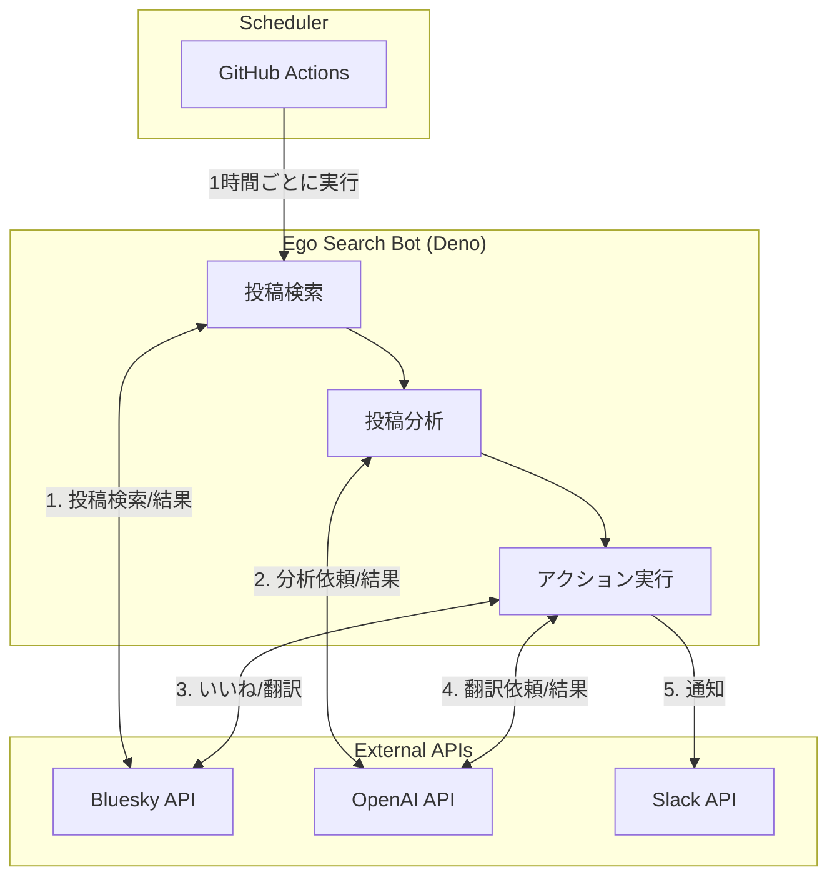

# 🤖 はじめに

個人で[Sky Follower Bridge](https://www.sky-follower-bridge.dev/)というXからBlueskyへの移行ツールを開発しているのですが、拡張機能の評判や不具合報告を見逃さないように、Blueskyでの関連投稿を定期的にチェックする必要がありました。

しかし、手動でのチェックは時間がかかり、見落としも発生します。そこで、GitHub ActionsとChatGPTを活用してエゴサーチを自動化するbotを作成したので紹介します。

# 🔍 作ったもの

[sfb-ego-searcher](https://github.com/kawamataryo/sfb-ego-searcher)。Sky Follower BridgeについてのBlueskyの投稿を監視するbotです。

https://github.com/kawamataryo/sfb-ego-searcher

**機能**

- 🔄 **自動実行**: GitHub Actionsで1時間ごとに実行され、24時間体制で投稿を監視
- 🧠 **LLMによる投稿分類**: ChatGPT（GPT-4o-mini）による投稿内容の意味理解と分類
- 💖 **自動Like**: 対象の投稿に自動でいいねを付ける
- 💬 **自動返信**: 特定のキーワードに対して自動で返信する
- 📢 **Slack通知**: 投稿の種類に応じた適切なアクションと通知
- 🇯🇵 **日本語翻訳**: 多言語の投稿の日本語訳も合わせてSlackに通知

# 🛠️ 実装の解説

## 技術スタック

- [Deno](https://deno.land/) 
- [GitHub Actions](https://github.com/features/actions) 
- [OpenAI API（GPT-4）](https://openai.com/blog/openai-api) 
- [Bluesky API](https://atproto.com/docs) 
- [Slack API](https://api.slack.com/) 

## 処理フロー

ざっくりの処理フローは以下の通りです。

## 関連投稿の検索

関連投稿の検索では、表記揺れを含む関係ありそうなキーワードについて、Bluesky APIの`searchPosts`を使って検索しています。

GitHub Actionsは1hに1回実行されるので、スクリプトの実行時間を考慮して1h+5分前の投稿を検索対象にしています。

https://github.com/kawamataryo/sfb-ego-searcher/blob/master/src/constants.ts#L1-L11

https://github.com/kawamataryo/sfb-ego-searcher/blob/master/src/main.ts#L33-L44

## 投稿の分類とアクション

投稿の処理は`PostProcessor`クラスで行います。投稿の分析結果に応じて、適切なアクションを実行します。

https://github.com/kawamataryo/sfb-ego-searcher/blob/master/src/services/post_processor.ts#L20-L63

## 投稿内容の解析

投稿内容が本当にSky Follower Bridgeに関係あるかどうかは、gpt-4o-miniにより解析します。

`response_format: { type: "json_object" }`を指定し、

- 対象投稿か否か？
- バグ報告を含むか？
- スパムURLを含むか？

を解析して、結果のJSONを返すようにしています。

https://github.com/kawamataryo/sfb-ego-searcher/blob/master/src/helpers/openai_client.ts#L44-L107

## 解析結果に応じて投稿を処理

解析結果に応じて、Slack通知やいいね、返信などのアクションを行います。
Sky Follower Bridgeには、類似のスパムサイトがあります。そのURLを含む投稿の場合は、正規の公式サイトに誘導する返信を行います。

- 対象投稿 -> すべていいね & 投稿URLと内容の日本語訳をSlackに通知
- バグ報告 -> @channelメンションでSlackに通知
- スパムURL -> 正規の公式サイトに誘導する返信を行い、Slackに通知

https://github.com/kawamataryo/sfb-ego-searcher/blob/master/src/services/post_processor.ts#L104-L164

Slackにはこのような通知が来ます。
ユーザーはほぼ海外の人たちなので、日本語の翻訳がとても役立ってます。

:::message
スパムサイトの件についてはこちらで詳しく解説しています🥲
https://bsky.app/profile/kawamataryo.bsky.social/post/3lcicsmfskc2b
:::

## GitHub Actionsによる定期実行

GitHub Actionsのワークフローは以下のように設定しています。1時間ごとに実行され、必要な環境変数を設定してスクリプトを実行します。

https://github.com/kawamataryo/sfb-ego-searcher/blob/master/.github/workflows/ego-search.yml#L1-L26

 
# 💰 運用コスト

このbotの運用で気になるのは、ChatGPT APIの料金だと思います。動かす前は結構コスト高いかなと思っていたのですが、実際に運用してみると、予想以上に低コストで運用できています。

1日に約100投稿ほど解析していますが、ChatGPT APIの料金は今の所 **$0.01以下/日** です。自分でエゴサーチする負担を考えると全然割安だと感じています。

# 🦋 まとめ

以上、エゴサーチを自動化するbotの紹介でした。

このbotを通じて、Blueskyに開かれたAPIがあることの嬉しさを実感しました。これをXのAPIで実装しようとすると月何千ドルも支払うことになります💰

Blueskyのようなエンジニアフレンドリーなプラットフォームが、今後も発展していくことを願っています。

:::message
おまけ。実はsfb-ego-searcherの80%のコードは、Cursor Agentに書いてもらいました。やりたいことの雑コードを自分で書いて、その後のリファクタやデバッグは全てAgentに丸投げです。Agentの便利さを実感しました。ただ同時に、職業エンジニアとしてのキャリアについての怖さも感じています😇
:::
