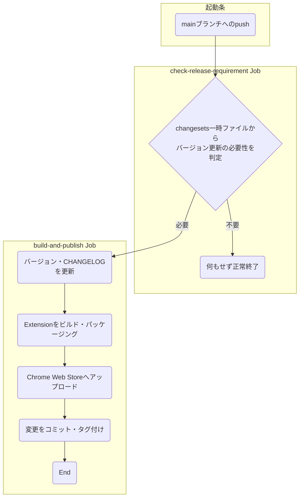

個人的に満足するChrome拡張自動リリース環境が組めたので紹介です。

# やりたかったこと

- 手動ビルド、バージョニング、ストアへの手動登録が面倒なので自動化したい
- コード変更したら自動でバージョニングしてストアに登録してほしい
- **でもreleaseブランチは作りたくない**。mainブランチのみで開発したい
- **時にはリリース関係なく直接mainブランチにcommit**したい
- commit messageとバージョニングは分離したい

と要望多めな怠惰なリリース環境を求めていたのですが、ChangesetsとGitHub Actionsでいい感じに実現できました。

# Changesetsとは？

# 組んだGitHub Actions

最終的なGitHub Actionsです。実際の実行結果はこちらで確認できます。
https://github.com/kawamataryo/sky-follower-bridge/actions

```yml:.github/workflows/publish.yml
name: "Publish to Chrome Web Store"
on:
  push:
    branches:
      - main

jobs:
  # リリース判定Job
  check-release-requirement:
    runs-on: ubuntu-latest
    steps:
      # ビルド環境構築
      - uses: actions/checkout@v3
      - uses: actions/setup-node@v3
        with:
          node-version: '18'
          check-latest: true
      - name: Cache npm dependencies
        uses: actions/cache@v3
        with:
          path: ~/.npm
          key: ${{ runner.os }}-node-${{ hashFiles('**/package-lock.json') }}
          restore-keys: |
            ${{ runner.os }}-node-
      - name: Install dependencies
        run: npm ci

      # リリース判定
      - name: Check if release is required
        run: ls .changeset/*.md > /dev/null 2>&1 && echo "result=release-required" >> $GITHUB_OUTPUT || echo "result=no-release-required" >> $GITHUB_OUTPUT
        id: check_release
        continue-on-error: true

    outputs:
      release: ${{ steps.check_release.outputs.result }}

  # リリースJob
  build-and-publish:
    needs: check-release-requirement
    # リリースが必要な場合のみ実行
    if: needs.check-release-requirement.outputs.release == 'release-required'
    runs-on: ubuntu-latest
    steps:
      # ビルド環境構築
      - uses: actions/checkout@v3
      - uses: actions/setup-node@v3
        with:
          node-version: '18'
          check-latest: true
      - name: Cache npm dependencies
        uses: actions/cache@v3
        with:
          path: ~/.npm
          key: ${{ runner.os }}-node-${{ hashFiles('**/package-lock.json') }}
          restore-keys: |
            ${{ runner.os }}-node-
      - name: Install dependencies
        run: npm ci

      # バージョン更新
      - name: Update version
        run: npx changeset version

      - name: Tag version
        run: npx changeset tag

      # ビルド・パッケージング
      - name: Build the extension
        run: npm run build

      - name: Package the extension into a zip artifact
        run: npm run package

      # Chrome Web Storeへのアップロード
      - name: Publish to Chrome Web Store
        uses: PlasmoHQ/bpp@v3
        with:
          keys: ${{ secrets.PUBLISH_KEYS }}
          artifact: build/chrome-mv3-prod.zip

      # バージョン更新コミット
      - name: Commit & Push changes
        uses: actions-js/push@master
        with:
          github_token: ${{ secrets.GITHUB_TOKEN }}
          message: "🔖 bump version"
          tags: true
```

処理内容をワークフロー図で表すと以下のようになっています。



# 工夫したところ

ポイントはトリガーをmainブランチへのpushという緩い条件にしつつ、**バージョン更新の必要性をchangesetsで判定してリリースを実行**しているところです。

こうすることで、Releaseブランチを作らずにmainブランチのみの開発でも、必要な時のみリリースできます。

また、もしリリースの必要がない場合は、実行自体を失敗としても良かったのですが、mainブランチのCIが落ちているのは違和感があるので`continue-on-error: true`でエラーを回避した上で次のJobで実行判定しています。

```yml:.github/workflows/publish.yml
jobs:
  # リリース判定Job
  check-release-requirement:
      # ...
      # リリース判定
      - name: Check if release is required
        run: ls .changeset/*.md > /dev/null 2>&1 && echo "result=release-required" >> $GITHUB_OUTPUT || echo "result=no-release-required" >> $GITHUB_OUTPUT
        id: check_release
        continue-on-error: true

    outputs:
      release: ${{ steps.check_release.outputs.result }} # この値が次のJobに渡される

  # リリースJob
  build-and-publish:
    needs: check-release-requirement
    # リリースが必要な場合のみ実行
    if: needs.check-release-requirement.outputs.release == 'release-required'
    # ...
```
