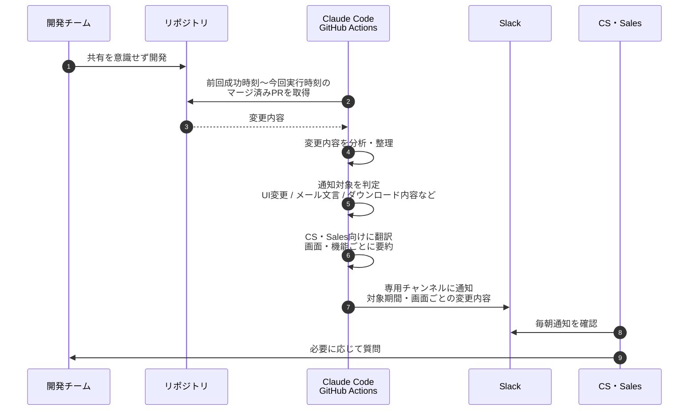

こんにちは。Nstock の川俣です。

ある課題意識から [Claude Code GitHub Actions](https://code.claude.com/docs/ja/github-actions)（以下 Claude Code Actions）を使って、プロダクトの変更を開発チームの外へ共有する仕組みを作ってみたので紹介します。

# 何が課題だったのか？

Nstockでは開発チーム内でCoding Agentの利用が標準となっています。そして最近では、デザイナーなどエンジニア以外のメンバーも、Coding Agentを使いプルリクエストを作るようになりました。

その影響でプロダクトの開発速度は確実に上がっています。

実際に株式報酬SaaSの開発チームでは、PRの月平均マージ数が2025年6月〜12月の約200件から、2026年1月〜4月には約300件まで増えていました。2026年4月には400件以上のPRがマージされており、**平日換算では1日あたり約20件の変更がmainに入っている**計算になります。

そのような中で課題になったのが、プロダクトの変化が早すぎてCustomer Success（以下CS）やSalesなど **`開発チームの外にいるメンバーが現状のプロダクトの状態を把握できなくなる`** というものでした。

大きな機能追加はスプリントレビューで連携するというルールはあったのですが、小さな変更（細かいUI変更や、サブ機能、バグ修正）は開発者の裁量に任せられていました。

CS・Salesがすべての変更を自分たちで追うのは現実的ではありません。
一方で、開発チームが毎回「これは共有すべきか」を判断して説明するのも負荷になります。

すべて共有するとノイズになる。しかし、共有されないと顧客説明に影響が出る。この間をどう埋めるかが課題でした。

:::message
💡 前提として、Nstockの株式報酬SaaSチームでは、mainにマージされたPRが都度リリースされるデプロイ戦略を取っています。もし週次の定期リリースなどで運用しているチームでは、課題の出方は少し変わるかもしれません。
:::

# どう解決したのか？

プロダクトの変更差分をClaude Code Actionsで読み取り、CS・Salesが知るべき変更だけを抽出してSlackに通知する仕組みを作りました。

1. 開発チームは共有を意識せずいつも通り開発
2. GitHub ActionsのCronトリガーで定時にworkflowを起動
    1. 前回workflow成功時から現在時刻までの変更内容を取得
    2. Claude Code Actionsで変更内容を解析し、ページ単位で非エンジニア向けに共有すべき内容をまとめる
    3. Slackの専用チャネルに通知
3. CS・Salesが適宜確認
4. 疑問があれば開発チームに質問

という流れです。開発チームとCS・Salesチームの間にAgentを置いて、情報共有をサポートするイメージです。



実際のSlack投稿文はこちらです。PR単位ではなく、画面・機能ごとに変更内容をまとめ、CS・Salesが確認しやすい形で通知しています。


*Slack通知の例（画面・機能ごとにまとめた通知）*

GitHub Actionsのworkflowとpromptはこちらです。

::::details workflow（抜粋）

```yaml:.github/workflows/ui-change-detector.yml
# mainブランチの前回チェック成功以降にマージされたPRのUI変更を検知し、Slackにまとめて通知するGitHub Actions
name: UI Change Detector

# ...

jobs:
  detect-ui-changes:
    # ...
    - name: Build prompt
      id: build-prompt
      if: steps.check.outputs.has_commits == 'true' && steps.merged-prs.outputs.count != '0'
      env:
        REPO: ${{ github.repository }}
        SINCE: ${{ steps.period.outputs.since }}
        UNTIL: ${{ steps.period.outputs.until }}
      run: |
        PROMPT=$(cat .github/prompts/ui-change-detector.md)
        REPO_TOKEN='__REPO__'
        SINCE_TOKEN='__SINCE__'
        UNTIL_TOKEN='__UNTIL__'
        PROMPT="${PROMPT//$REPO_TOKEN/$REPO}"
        PROMPT="${PROMPT//$SINCE_TOKEN/$SINCE}"
        PROMPT="${PROMPT//$UNTIL_TOKEN/$UNTIL}"
        {
          echo 'prompt<<EOF'
          echo "$PROMPT"
          echo 'EOF'
        } >> "$GITHUB_OUTPUT"

    - name: Analyze merged PRs with Claude
      id: analyze
      if: steps.check.outputs.has_commits == 'true' && steps.merged-prs.outputs.count != '0'
      uses: anthropics/claude-code-action@2f8ba26a219c06cfb0f468eef8d97055fa814f97
      continue-on-error: true
      with:
        use_bedrock: "true"
        track_progress: false
        show_full_output: false
        prompt: ${{ steps.build-prompt.outputs.prompt }}

        claude_args: |
          --model global.anthropic.claude-opus-4-6-v1
          --max-turns 100
          --json-schema '{"type":"object","properties":{"changes":{"type":"array","items":{"type":"object","properties":{"feature":{"type":"string"},"details":{"type":"array","items":{"type":"string"}}},"required":["feature","details"],"additionalProperties":false}}},"required":["changes"],"additionalProperties":false}'

    # ...
    - name: Notify Slack when UI changes are detected
      if: steps.validate.outputs.valid == 'true' && steps.validate.outputs.change_count != '0'
      env:
        STRUCTURED_OUTPUT: ${{ steps.analyze.outputs.structured_output }}
        SLACK_BOT_TOKEN: ${{ secrets.SLACK_BOT_TOKEN }}
        SLACK_CHANNEL: ${{ vars.SLACK_CHANNEL_ID_FOR_UI_CHANGE }}
        SINCE: ${{ steps.period.outputs.since }}
        UNTIL: ${{ steps.period.outputs.until }}
      run: |
        .github/scripts/notify-ui-changes-to-slack.sh
```

::::

::::details prompt（抜粋）

```markdown:.github/prompts/ui-change-detector.md
REPO: __REPO__
SINCE: __SINCE__
UNTIL: __UNTIL__

`merged-prs.json` に記載されている、対象期間内にマージされたPRを分析してください。
`gh pr view`, `gh pr diff`, `git diff`
などファイル読み取りなど必要なツールを自律的に使って情報収集してください。

## 出力

Structured Output のスキーマに従う

- changes: UI変更の配列
  - feature: 画面名または機能名
  - details: その画面・機能でユーザーから見て何がどう変わったかの配列

## 対象PR

- マージ済みPRのみ対象
- Renovate PRは対象外
- ユーザーに公開済みの機能に影響する変更のみ対象

## 検知対象

- UI変更（表示要素・スタイル・テキスト・ページの追加削除など、画面として見える変化）
- メールのテンプレート・文言の変更
- ダウンロードファイルの形式・内容の変更
- APIレスポンスの変更のうち、フロントエンドで実際に使用されているフィールドの変更

## 対象外

- ロジック・リファクタリングなど描画結果が変わらないもの
- ボタンの色・形、枠幅、余白、列幅、フォントサイズなど、業務上の理解や案内に影響しない軽微な見た目調整
- APIフィールドの追加・変更のうち、フロントエンドで未使用のもの
- 型定義・テスト・設定ファイルのみの変更

## 記述ルール

- 読む人はカスタマーサクセスやセールスなどの非エンジニアを想定する
- 技術用語・実装詳細は使わない（コンポーネント名、APIエンドポイント、ファイル名、プロパティ名など）
- Slack通知では `feature` が見出し、`details` が箇条書き本文として表示される前提で書く
- 1つの `changes[]` は1つの画面または機能に対応させる
- 複数のPRが同じ画面・機能を変更している場合は、1つの `changes[]` にまとめる
- 1つのPRが複数の画面・機能を変更している場合は、画面・機能ごとに `changes[]` を分ける
- ユーザー目線で「その画面・機能で、何が、どう変わったか」を書く
- 画面名は技術的なパスではなく、画面上のタイトルや機能名で表現する
  - NG: `/plans/[id]` の `PlanDetailCard` に `isExpired` フラグを追加
  - OK: プラン詳細画面に「有効期限切れ」の表示が追加された
- メール変更の場合は件名や用途でメールを特定する。
  - NG: `welcome_email.html` のコピー変更
  - OK: 登録完了メールの本文に「〇〇」の文言が追加された
- details の各項目は1件あたり120文字以内
- 同じ画面・機能内で複数の変更がある場合は、details の要素を分ける
- feature は短く具体的にする
  - OK: 新株予約権原簿
  - OK: 発行・消却の登記対象一覧
  - NG: UI変更
  - NG: 管理画面
```

出力イメージは次のとおりです。

```json
{
  "changes": [
    {
      "feature": "新株予約権原簿",
      "details": [
        "原簿作成画面のプラン一覧で、確定済みの全プランが表示されるようになりました。",
        "付与対象者数の算出方法が変わり、従来と表示人数が異なる場合があります。"
      ]
    },
    {
      "feature": "発行・消却の登記対象一覧",
      "details": [
        "登記対象一覧で、効力発生日を確認しやすい表示に調整しました。",
        "対象イベントの発生日を見ながら登記作業を進められます。"
      ]
    }
  ]
}
```

::::

:::message
💡 1 WorkflowあたりのClaude Code ActionsのAPI費用は、Opus 4.6利用で$0.5〜$2ほどでした。
:::

# 運用してみてのふりかえり

一定期間運用した後、関係チームにアンケートを取りました。

| 項目 | 平均 |
| --- | --- |
| 課題解決度 | 7.4 / 10 |
| AI 検知・要約の精度 | 8.8 / 10 |
| 他チームへの推奨度 | 7.8 / 10 |

回答者全員が週 1 以上確認していて、62.5％ は毎日確認していました。専用チャンネルを確認する流れが、ある程度日常のワークフローに組み込まれていそうです。

要約の精度が高いと評価してもらえたのは意外でした。モデルの性能に助けられている部分も大きそうですが、通知として役に立っているようです。

またフリーコメントでは、次のような反応がありました。

| コメント抜粋 |
| --- |
| タイムリーにアップデートが共有されるのでありがたい。 |
| 細かい差分で毎回通達するのが大変な問題をかなり解消できている。スクショ差分も出てほしい |
| AI による UI 変更検知だとは知らなかったです。検知できていない変更があるかは分からないですが、多分良さそうです |
| 仕組みをある程度理解していないと難しそう。システムによって要望も違いそうだが、作ってもらえて助かっている |

ある程度効果があることが分かったので、今後は変更差分のスクショの貼り付けなど、通知内容の改善に取り組んでいこうと思っています。

:::message
💡 以下のように画像化して社内新聞風にするとか、別の切り口でTTSのツールを使いラジオ化するとかも面白いかもと思ってます（やりすぎ感はある）
:::


*社内新聞風にまとめた共有イメージ*

# おわりに

仕組み自体は、PRの差分を読んでSlackに流すだけのシンプルなものです。

それでもアンケートの結果を見ると、CS・Salesの日常業務の中で実際に使われていて、プロダクトの変化を届ける仕組みとして一定の効果がありそうでした。作ってよかったなと思っています。

同じ問題意識から、ヘルプページの更新検知にも取り組んでいます。こちらも別の記事で紹介できればと思います。
