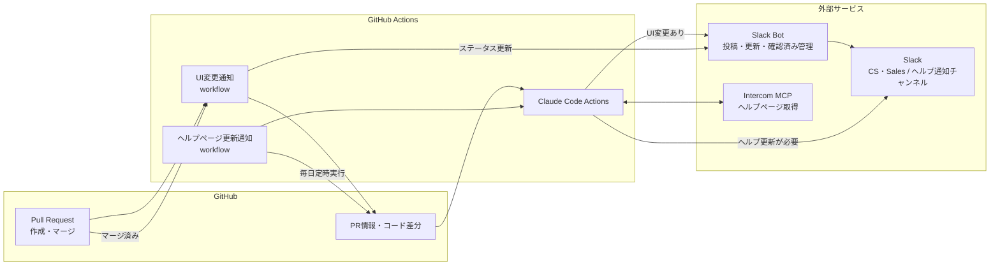

# はじめに

こんにちは。Nstock の川俣です。

Nstock のプロダクト開発で、Claude Code Actions を使って UI 変更通知とヘルプページ更新通知を自動化する仕組みを作ったので紹介します。

# 何が課題だったのか

プロダクト開発が速くなるほど、UI の変更も増えます。そして、変更を追うコストは、開発チームの外にいるメンバーほど重くなります。

CS・Sales が把握すべき UI 変更は、リリースノートに載るような大きなものばかりではありません。

- ボタンの文言が変わる
- 導線が少し変わる
- 入力項目が増える
- 設定画面の位置が変わる
- まだ一部のお客様だけに出ている機能がある

こうした変更は、開発側からすると小さく見えても、顧客に説明する側にとっては、実際の画面が自分たちの認識と少し違うだけでも対応に迷います。
ヘルプページの内容も、プロダクトに追従させる必要があります。

一方で、エンジニアが UI 変更のたびに CS・Sales へ共有しようとすると、開発フローに手作業が増えます。

- 共有し忘れる
- どの粒度で共有すべきか迷う
- 開発中の変更とリリース済みの変更が混ざる
- 細かい変更まで毎回説明するのは大変

AI Coding Agent で実装速度が上がるほど PR の数や変更量が増えるので、人間が気合いで共有する運用はどんどんつらくなっていきます。

そこで、開発者は普段通り PR を作るだけで、必要な変更が CS・Sales やヘルプページ運用に届く仕組みを作ることにしました。

# 作ったもの

作った仕組みは 2 つです。

|仕組み|目的|トリガー|通知先|
|---|---|---|---|
|UI 変更通知|CS・Sales が UI 変更を把握できるようにする|PR 作成・マージ|UI 変更通知用 Slack チャンネル|
|ヘルプページ更新通知|ヘルプページとプロダクトのずれを検知する|毎日定時|ヘルプページ更新通知用 Slack チャンネル|

全体の構成は次のようなイメージです。

# UI変更通知

UI 変更通知は、PR 作成時に GitHub Actions 上で Claude Code Actions を起動し、差分を読んでもらう仕組みです。
Claude Code には、次のような観点で判定してもらいます。

- ユーザーに見える UI 変更があるか
- CS・Sales が把握しておくべき変更か
- 非エンジニア向けにどう説明すべきか

通知には、変更概要、関連 Issue / PR、検証環境の URL、ステータスなどを含めています。PR がマージされたら Slack メッセージのステータスも更新します。

実際の通知は次のような形です。

Slack メッセージには確認済みボタンも用意しています。誰が確認したかを Slack 上で確認できるので、専用の管理画面は作っていません。

# ヘルプページ更新通知

ヘルプページ更新通知は、毎日定時に GitHub Actions で実行しています。
前回実行時からのプロダクト差分を Claude Code に渡し、Intercom MCP 経由で取得した現在のヘルプページと比較します。更新が必要と判断された場合だけ Slack に通知します。

通知には、次の情報を含めています。

- 更新が必要な理由
- 修正すべき内容
- 該当するヘルプページの URL
- Intercom の編集 URL
- プロダクトの該当画面 URL

特に、Intercom の編集 URL まで通知に含めたのはよかったです。通知を見た CS メンバーが、そのまま編集を始められます。

実際の通知は次のような形です。

# 運用してみてどうだったか

一定期間運用した後、UI 変更通知についてアンケートを取りました。
回答者は 8 名で、内訳は Customer Success 3 名、Sales 2 名、Engineer / QA 2 名、PdM 1 名です。

|項目|平均|
|---|---:|
|課題解決度|7.4 / 10|
|AI 検知・要約の精度|8.8 / 10|
|推奨度|7.8 / 10|

回答者全員が週 1 以上確認していて、62.5％ は毎日確認していました。専用チャンネルを確認する流れが、ある程度日常のワークフローに組み込まれていそうです。

フリーコメントでは、次のような反応がありました。

|職種|コメント抜粋|
|---|---|
|Sales|UI 変更のステータスが把握できるので助かる|
|Sales|タイムリーにアップデートが共有されるのでありがたい。リリース済みの機能に絞って確認できるとさらに嬉しい|
|Customer Success|AI による UI 変更検知だとは知らなかったです。検知できていない変更があるかは分からないですが、多分良さそうです|
|PdM|細かい差分で毎回通達するのが大変な問題をかなり解消できている。スクショ差分も出てほしい|
|Customer Success|仕組みをある程度理解していないと難しそう。システムによって要望も違いそうだが、作ってもらえて助かっている|

「AI による UI 変更検知だとは知らなかった」というコメントは、個人的にはよいフィードバックでした。使う側からすると、裏側が AI かどうかはそこまで重要ではなく、必要な情報が自然に届くことが大事だと感じました。

ヘルプページ更新通知についても好評でした。更新が必要だと気づける、何を直せばよいか分かる、編集ページへすぐ移動できるのがよい、といった反応がありました。

# 良かったこと

エンジニアの開発フローを変えなくてよいのが一番よかったです。PR を作れば自動で Claude Code Actions が動き、必要に応じて Slack に通知されます。

CS・Sales 側も、新しいツールを見に行く必要はありません。専用の Slack チャンネルを見れば変更が流れてきます。

また、AI に任せる範囲も、現時点ではちょうどよいバランスだと感じています。差分の読解、ユーザー影響の判断、要約、ヘルプページとの比較までは AI に任せて、最終判断や顧客向けの表現調整は人間が行うようにしています。

# 課題

良い結果が出ている一方で、まだ課題もいくつかあります。

## 未リリース機能も通知される

Feature Flag 配下の機能や、まだリリース前の変更も通知されることがあります。
CS・Sales 側からすると、「これは今お客様に案内してよい機能なのか？」を判断しづらいケースがあります。

今は、その機能に実際に到達可能かを AI でチェックする Skills を用意して、リリース前かどうかを判定する材料にできないか試しているところです。

## 精度の透明性

AI 検知・要約の精度は高く評価されました。一方で、「検知できていない変更があるかどうかは分からない」という声もありました。

今後は、通知しなかった理由や、対象外と判断した変更のサマリーも見られるようにすると、より安心して使えそうです。

## スクリーンショット更新はまだ手作業

ヘルプページ更新通知では、テキストの修正候補は出せるようになりました。ただ、ヘルプページ内のスクリーンショット更新はまだ手作業です。
今は、Playwright を使ってヘルプページ用の撮影環境にログインし、該当画面の最新スクリーンショットを Slack 通知に添付する仕組みを作っています。

# おわりに

AI Coding Agent によって、プロダクト開発の速度はさらに上がっていきます。
その速さが CS・Sales やサポートコンテンツ運用の負担にならないように、今後も仕組みを改善していきたいです。

Nstock Tech Blog では、こうしたプロダクト開発や社内の開発体験改善の取り組みも発信していく予定です。
